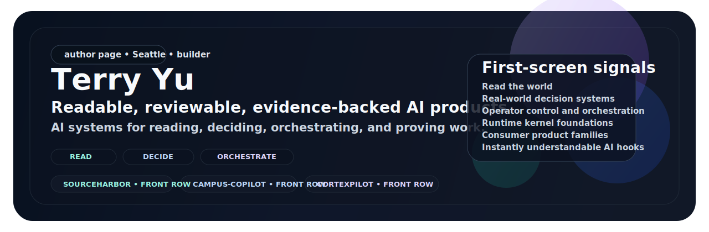

  

<h1 align="center">Terry Yu</h1>

<strong>Builder of readable, reviewable, evidence-backed AI products.</strong> Local-first AI systems for reading, deciding, orchestrating, and proving work.

  
  
  
  

  <a href="https://github.com/xiaojiou176-open"><strong>See the full universe</strong></a> •
  <a href="#start-with-the-front-row"><strong>Start with the front row</strong></a> •
  <a href="#how-to-read-the-universe"><strong>How to read the universe</strong></a> •
  <a href="https://www.linkedin.com/in/terry-yu-52b6b1252"><strong>LinkedIn</strong></a>

I build AI products that make messy inputs and black-box workflows easier to read, review, and trust. The goal is not to ship decorative demos. It is to turn real work into systems people can inspect, decide with, and recover when something breaks.

## Start with the front row

These three flagship doors are the fastest way to understand the center of the portfolio.

<table>
  <tr>
    <td width="33%" valign="top">
      <strong><a href="https://github.com/xiaojiou176-open/sourceharbor">SourceHarbor</a></strong> 
      <strong>Read</strong> 
      Turn raw source streams into readable, traceable documents people can actually use.
    </td>
    <td width="33%" valign="top">
      <strong><a href="https://github.com/xiaojiou176-open/campus-copilot">campus-copilot</a></strong> 
      <strong>Decide</strong> 
      Bring real academic systems into one local-first decision workspace with clear boundaries.
    </td>
    <td width="33%" valign="top">
      <strong><a href="https://github.com/xiaojiou176-open/CortexPilot-public">CortexPilot-public</a></strong> 
      <strong>Orchestrate</strong> 
      Run governed AI workflows with evidence, replay, and operator visibility.
    </td>
  </tr>
</table>

## Why this work deserves a closer look

- **Local-first**: ownership, recovery, and user control matter.
- **Reviewable**: outputs are meant to be checked, not blindly trusted.
- **Evidence-backed**: systems show what happened instead of hiding behind magic.
- **Boundary-honest**: the limits are part of the product design, not something hidden after the demo.

## What the first screen is telling you

The six pinned repos on this page are not a random top list. Together they say:

1. **SourceHarbor**: I can read the world and rewrite it into something usable.
2. **campus-copilot**: I can place AI inside real, high-constraint decision work.
3. **CortexPilot-public**: I can build operator-grade control and orchestration systems.
4. **Switchyard**: I have a real runtime kernel and access-layer foundation underneath the surface.
5. **Shopflow**: I can build consumer-visible product families, not just internal tools.
6. **multi-ai-sidepanel**: I also know how to make instantly understandable AI products that people want to try.

## How to read the universe

If you want the fastest map of the portfolio, use these five verbs:

| Verb | What it means here | Start with |
| --- | --- | --- |
| **Read** | Turn messy sources into readable, traceable products | [SourceHarbor](https://github.com/xiaojiou176-open/sourceharbor), [docsiphon](https://github.com/xiaojiou176-open/docsiphon) |
| **Decide** | Build workspaces that help people choose well under real constraints | [campus-copilot](https://github.com/xiaojiou176-open/campus-copilot), [dealwatch](https://github.com/xiaojiou176-open/dealwatch) |
| **Deliver** | Move from brief or intent to an actual working result | [CortexPilot-public](https://github.com/xiaojiou176-open/CortexPilot-public), [openui-mcp-studio](https://github.com/xiaojiou176-open/openui-mcp-studio), [movi-organizer](https://github.com/xiaojiou176-open/movi-organizer) |
| **Prove** | Keep evidence, replay, recovery, and inspection close to the work | [prooftrail](https://github.com/xiaojiou176-open/prooftrail), [ui-automation-control-plane](https://github.com/xiaojiou176-open/ui-automation-control-plane), [apple-notes-forensics](https://github.com/xiaojiou176-open/apple-notes-forensics), [agent-exporter](https://github.com/xiaojiou176-open/agent-exporter) |
| **Connect** | Build the runtime and access foundations that other products can stand on | [Switchyard](https://github.com/xiaojiou176-open/Switchyard) |

## Where to go next

- **See the full showroom**: [xiaojiou176-open](https://github.com/xiaojiou176-open)
- **Browse the seven product halls**: use the org page as the full atlas
- **Start with the pinned six**: if you only have a few minutes, they are the best first pass through the portfolio
