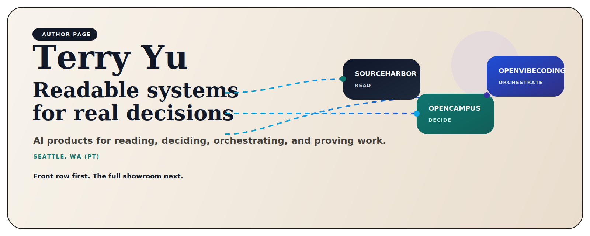
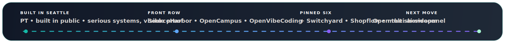

  

<h1 align="center">Terry Yu</h1>

<strong>Readable, reviewable AI products for messy inputs and risky work.</strong> I build local-first systems that help people read better, decide better, orchestrate better, and keep proof close to the action.

  <a href="https://github.com/xiaojiou176-open"><strong>Open the showroom</strong></a> •
  <a href="#1--start-with-the-front-row"><strong>Start with the front row</strong></a> •
  <a href="https://www.linkedin.com/in/terry-yu-52b6b1252"><strong>LinkedIn</strong></a> •
  <a href="#3--what-the-pinned-six-signal"><strong>Pinned six</strong></a> •
  <a href="#4--follow-the-rest-of-the-map"><strong>Read the map</strong></a>

  

> I keep ending up in the same class of problem: **too much noise, too much risk, and too many systems that ask for trust before they earn it.**  
> Built in **Seattle, WA (PT)**. Built in public. The product comes first. The proof stays visible.

## 1. 🚪 Start with the Front Row

If you only open three projects, start here. They are not a podium. They are the fastest way to understand what I actually build.

<table>
<tr>
<td width="33%" valign="top">

### SourceHarbor
**Turn raw inputs into reading-grade outputs.**  
A reading product for the age of information overload. It ingests raw source streams, merges them, and ships traceable documents a human would actually keep.

</td>
<td width="33%" valign="top">

### OpenCampus  
`campus-copilot` today  
**Choose under real constraints without crossing the line.**  
A local-first academic decision workspace that routes scattered school surfaces into one safer planning environment.

</td>
<td width="33%" valign="top">

### OpenVibeCoding  
`CortexPilot-public` today  
**Make execution trustworthy, not just impressive.**  
A governed control plane for requests, workflows, proof, and replay when the system breaks.

</td>
</tr>
</table>

## 2. 🧠 What I Actually Build

- **Readable systems.**  
  If the output is not something a person would actually keep, the workflow is unfinished.

- **Decision workspaces.**  
  I care about systems that help someone choose the next move when the surfaces are messy and the constraints are real.

- **Review-first execution.**  
  I do not trust systems that hide the dangerous step behind a smooth demo.

- **Proof close to the claim.**  
  If something ran, changed, or decided, another human should be able to inspect what happened.

## 3. 📌 What the Pinned Six Signal

The pinned six are not a popularity chart. Together they send six different first-screen signals.

1. **SourceHarbor**  
   Readable outputs come before dashboard theater.

2. **OpenCampus (`campus-copilot`)**  
   AI can enter a serious domain without pretending the boundary does not exist.

3. **OpenVibeCoding (`CortexPilot-public`)**  
   There is real workflow and control-plane depth underneath the surface products.

4. **Switchyard**  
   I also build the runtime and access layer underneath the visible tools.

5. **Shopflow**  
   System depth can turn into a browser-native product family real users can feel.

6. **multi-ai-sidepanel**  
   Some products should be instantly understandable and easy to try, not only deep and heavy.

## 4. 🗺️ Follow the Rest of the Map

If you want the shortest mental model, use these five verbs:

| Job | What it means here | Start here |
| --- | --- | --- |
| **Read** | Turn raw inputs into something worth reading and reusing. | [SourceHarbor](https://github.com/xiaojiou176-open/sourceharbor), [docsiphon](https://github.com/xiaojiou176-open/docsiphon) |
| **Decide** | Choose well under real constraints instead of drowning in scattered surfaces. | [campus-copilot](https://github.com/xiaojiou176-open/campus-copilot), [dealwatch](https://github.com/xiaojiou176-open/dealwatch) |
| **Deliver** | Move from intent or brief to a working result humans can review. | [CortexPilot-public](https://github.com/xiaojiou176-open/CortexPilot-public), [openui-mcp-studio](https://github.com/xiaojiou176-open/openui-mcp-studio), [movi-organizer](https://github.com/xiaojiou176-open/movi-organizer) |
| **Prove** | Keep evidence, replay, recovery, and inspection close to the work. | [prooftrail](https://github.com/xiaojiou176-open/prooftrail), [ui-automation-control-plane](https://github.com/xiaojiou176-open/ui-automation-control-plane), [apple-notes-forensics](https://github.com/xiaojiou176-open/apple-notes-forensics), [agent-exporter](https://github.com/xiaojiou176-open/agent-exporter) |
| **Connect** | Build the runtime and access foundation that other products can stand on. | [Switchyard](https://github.com/xiaojiou176-open/Switchyard) |

## 5. 🔗 Go Deeper

- **Want the full portfolio atlas?** Open the [xiaojiou176-open showroom](https://github.com/xiaojiou176-open).
- **Want the strongest first three doors?** Start with [SourceHarbor](https://github.com/xiaojiou176-open/sourceharbor), [campus-copilot](https://github.com/xiaojiou176-open/campus-copilot), and [CortexPilot-public](https://github.com/xiaojiou176-open/CortexPilot-public).
- **Want the browser-facing side first?** Open [Shopflow](https://github.com/xiaojiou176-open/shopflow-suite), [dealwatch](https://github.com/xiaojiou176-open/dealwatch), or [multi-ai-sidepanel](https://github.com/xiaojiou176-open/multi-ai-sidepanel).
