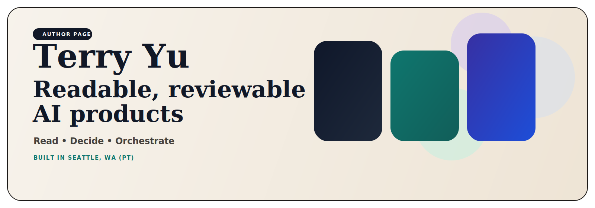

  

<h1 align="center">Terry Yu</h1>

<strong>Builder of readable, reviewable, evidence-backed AI products.</strong> Local-first AI systems for reading, deciding, orchestrating, and proving work.

  <a href="https://github.com/xiaojiou176-open"><strong>See the full showroom</strong></a> •
  <a href="#1--start-here"><strong>Start here</strong></a> •
  <a href="#3--what-the-pinned-six-cover"><strong>Pinned six</strong></a> •
  <a href="#5--read-the-rest-of-the-map"><strong>Read the map</strong></a> •
  <a href="https://www.linkedin.com/in/terry-yu-52b6b1252"><strong>LinkedIn</strong></a>

> I keep ending up in the same class of problem: **messy inputs, risky workflows, and systems that still need a human checkpoint before anyone should trust the result.**  
> Built in **Seattle, WA (PT)**. Shipped in public.

| **Readable** | **Reviewable** | **Evidence-backed** | **Boundary-honest** |
| --- | --- | --- | --- |
| outputs a human can keep | work a second human can inspect | proof next to the claim | no magic where the boundary matters |

## 1. 🚪 Start Here

If you only open three repos, make it these three. They are not a podium. They are the clearest way to understand what I actually build.

### 1.1 SourceHarbor
**Stop drowning in feeds.**  
Ingest raw source streams. Merge them. Ship reading-grade, traceable documents.  
This is the clearest entry into how I turn noisy information into something a human can actually keep.

### 1.2 campus-copilot
**No hallucinations allowed.**  
In a high-constraint academic system, the job is not “chat better.” The job is to route scattered surfaces into one decision workspace without crossing the safety boundary.

### 1.3 CortexPilot-public
**Execution needs proof.**  
This is the control-plane side of the portfolio: record the request, run the workflow, keep proof next to it, replay failures when the system breaks.

## 2. 🛠️ What I Actually Optimize For

- **Readability over dashboard theater.**  
  If the output is not something a person would actually read, the workflow is not finished.

- **Review before risky action.**  
  I do not trust systems that hide the dangerous step behind a smooth demo.

- **Local-first when trust and recovery matter.**  
  If ownership, rollback, or recoverability are part of the job, I want the system to show its work.

- **Proof close to the claim.**  
  If something ran, changed, or decided, another human should be able to inspect what happened.

## 3. 📌 What the Pinned Six Cover

The pinned six are not a popularity chart. Together they cover six different signals I want the first screen to send.

1. **SourceHarbor**  
   The portfolio starts with readable outputs, not feed overload.

2. **campus-copilot**  
   AI can enter a serious domain without pretending the boundary does not exist.

3. **CortexPilot-public**  
   There is real workflow and control-plane depth underneath the surface products.

4. **Switchyard**  
   I do not only ship surfaces. I also build the runtime and access layer underneath them.

5. **Shopflow**  
   System depth can still turn into browser-native products normal users can feel.

6. **multi-ai-sidepanel**  
   Not every good product has to be heavy. Some should be instantly understandable and easy to try.

## 4. ⚙️ The Pattern Underneath

- **Messy inputs become something a person can actually read.**
- **Risky actions stay visible long enough to review, rollback, or replay.**
- **The interesting part is not “AI can do it.” The interesting part is whether another human can inspect what happened afterward.**

## 5. 🗺️ Read the Rest of the Map

If you want the shortest mental model, use these five verbs:

| Verb | What it means here | Start here |
| --- | --- | --- |
| **Read** | Turn raw inputs into something worth reading and reusing. | [SourceHarbor](https://github.com/xiaojiou176-open/sourceharbor), [docsiphon](https://github.com/xiaojiou176-open/docsiphon) |
| **Decide** | Choose well under real constraints instead of drowning in scattered surfaces. | [campus-copilot](https://github.com/xiaojiou176-open/campus-copilot), [dealwatch](https://github.com/xiaojiou176-open/dealwatch) |
| **Deliver** | Move from intent or brief to a working result humans can review. | [CortexPilot-public](https://github.com/xiaojiou176-open/CortexPilot-public), [openui-mcp-studio](https://github.com/xiaojiou176-open/openui-mcp-studio), [movi-organizer](https://github.com/xiaojiou176-open/movi-organizer) |
| **Prove** | Keep evidence, replay, recovery, and inspection close to the work. | [prooftrail](https://github.com/xiaojiou176-open/prooftrail), [ui-automation-control-plane](https://github.com/xiaojiou176-open/ui-automation-control-plane), [apple-notes-forensics](https://github.com/xiaojiou176-open/apple-notes-forensics), [agent-exporter](https://github.com/xiaojiou176-open/agent-exporter) |
| **Connect** | Build the runtime and access foundation that other products can stand on. | [Switchyard](https://github.com/xiaojiou176-open/Switchyard) |

## 6. 🔗 Go Deeper

- **Want the full map?** Open the [xiaojiou176-open showroom](https://github.com/xiaojiou176-open).
- **Want the strongest three doors?** Start with [SourceHarbor](https://github.com/xiaojiou176-open/sourceharbor), [campus-copilot](https://github.com/xiaojiou176-open/campus-copilot), and [CortexPilot-public](https://github.com/xiaojiou176-open/CortexPilot-public).
- **Want the browser-facing side first?** Open [Shopflow](https://github.com/xiaojiou176-open/shopflow-suite) or [multi-ai-sidepanel](https://github.com/xiaojiou176-open/multi-ai-sidepanel).
