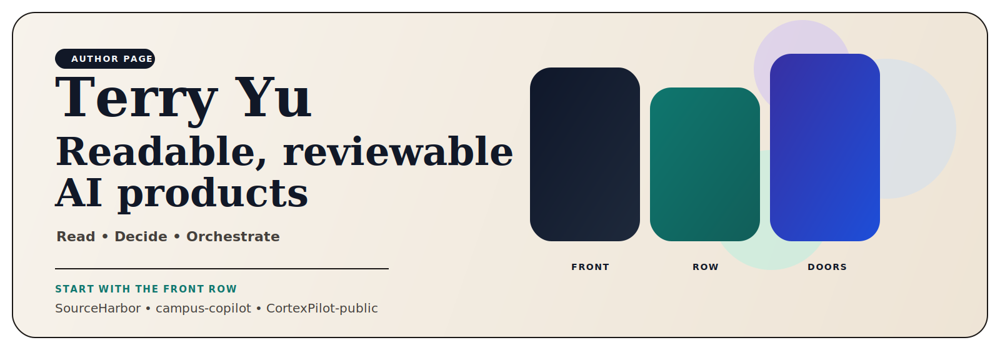

  

<h1 align="center">Terry Yu</h1>

<strong>Builder of readable, reviewable, evidence-backed AI products.</strong> Local-first AI systems for reading, deciding, orchestrating, and proving work.

  <a href="https://github.com/xiaojiou176-open"><strong>See the full showroom</strong></a> •
  <a href="#2--start-with-the-front-row"><strong>Start with the front row</strong></a> •
  <a href="#4--what-the-pinned-six-prove"><strong>What the pinned six prove</strong></a> •
  <a href="#6--read-the-universe-in-five-verbs"><strong>Read the universe</strong></a> •
  <a href="https://www.linkedin.com/in/terry-yu-52b6b1252"><strong>LinkedIn</strong></a>

> **Why this page exists**  
> If you only have a minute, this page should answer four questions fast: **Who is Terry? What is he building? Why is this worth trusting? Where should I click first?**

| **Readable** | **Reviewable** | **Evidence-backed** | **Boundary-honest** |
| --- | --- | --- | --- |
| outputs people can keep | work humans can inspect before action | proof stays close to the claim | no fake magic, no unsafe overreach |

## 1. ✨ Why Start Here

1. **This is not a pile of unrelated AI demos.**  
   The repos connect into one product universe with a shared spine: readable outputs, visible review paths, proof when systems make claims, and honest boundaries when they cannot safely do more.

2. **The work solves real jobs, not just model-wrapper problems.**  
   Across the portfolio, the recurring move is the same: turn noisy inputs, scattered institutional surfaces, or fragile automation into something a human can actually understand and trust.

3. **The page is designed to help you choose fast.**  
   If you want the quickest read, open the three flagship doors. If you want the full map, jump to the showroom. If you want to test breadth, scan the pinned six.

## 2. 🚪 Start With the Front Row

These are not medal winners. They are the three clearest doors into the core story of the portfolio.

<table>
  <tr>
    <td width="33%" valign="top">
      <strong><a href="https://github.com/xiaojiou176-open/sourceharbor">SourceHarbor</a></strong> 
      <strong>Read</strong>  
      <strong>The need</strong> 
      More feeds, more links, and more summaries still leave people doing the synthesis by hand.  
      <strong>The breakout</strong> 
      A reader-first system that rewrites raw source streams into traceable documents worth actually keeping.  
      <strong>Why open it first</strong> 
      It is the fastest way to understand Terry's "read the world, then make it usable" thesis.
    </td>
    <td width="33%" valign="top">
      <strong><a href="https://github.com/xiaojiou176-open/campus-copilot">campus-copilot</a></strong> 
      <strong>Decide</strong>  
      <strong>The need</strong> 
      In real academic systems, knowing where the data lives still does not tell a student what to do next.  
      <strong>The breakout</strong> 
      A local-first decision workspace that helps people act inside a high-constraint domain without faking the boundary.  
      <strong>Why open it first</strong> 
      It proves the portfolio can enter a real, sensitive setting and still stay trustworthy.
    </td>
    <td width="33%" valign="top">
      <strong><a href="https://github.com/xiaojiou176-open/CortexPilot-public">CortexPilot-public</a></strong> 
      <strong>Orchestrate</strong>  
      <strong>The need</strong> 
      Many AI workflows can run, but cannot be trusted, because request, execution, proof, and replay are split apart.  
      <strong>The breakout</strong> 
      A governed control plane that keeps execution, evidence, and replay in the same system instead of scattering them across tools.  
      <strong>Why open it first</strong> 
      It is the clearest proof that Terry builds operator-grade systems, not just thin AI product shells.
    </td>
  </tr>
</table>

## 3. 🧠 Why These Three Earn the First Click

- **SourceHarbor** proves Terry can turn information overload into something a person would actually read.
- **campus-copilot** proves Terry can place AI inside a real, high-constraint domain without bluffing the limits.
- **CortexPilot-public** proves Terry can build the system layer underneath the product, not just the surface.

Together they answer three first-screen questions:

1. Can he make messy information readable?
2. Can he make hard decisions easier in the real world?
3. Can he build governed execution instead of black-box automation?

## 4. 📌 What the Pinned Six Prove

The pinned six are not a popularity chart. Together they are the first-screen argument for why Terry is worth taking seriously.

| Pinned repo | The user problem it points at | Why it belongs on the first screen |
| --- | --- | --- |
| **SourceHarbor** | Raw sources are noisy, fragmented, and hard to truly read. | Shows the universe begins with readable outputs, not feed overload. |
| **campus-copilot** | Real systems are constrained and confusing; users still need a trustworthy next step. | Shows Terry can build AI for serious domains, not only demos. |
| **CortexPilot-public** | Workflows often run without proof, replay, or governance. | Shows the control-plane depth underneath the products. |
| **Switchyard** | AI products keep rebuilding the same runtime and access layer. | Shows there is a reusable kernel underneath the visible products. |
| **Shopflow** | Consumer browser workflows usually become one-off scripts instead of coherent product lines. | Shows Terry can build product families normal users can actually feel. |
| **multi-ai-sidepanel** | Comparing models is still awkward, fragmented, and hard to inspect. | Shows Terry can also ship a fast, instantly understandable AI hook that pulls people deeper into the portfolio. |

## 5. 🔥 Why This Is Worth Opening Instead of Another AI Repo Page

- **Because the repos are stitched into a product logic.**  
  This page is not asking you to admire isolated tricks. It is showing how reading, deciding, orchestration, runtime, consumer-facing product work, and proof support one another.

- **Because the products keep the human in the loop where trust matters.**  
  Review, rollback, replay, and boundary-honest design appear again and again.

- **Because the portfolio is trying to do something harder than “AI that works on a demo.”**  
  It is trying to make AI systems understandable enough to inspect, trustworthy enough to rely on, and concrete enough to hand to another human.

## 6. 🗺️ Read the Universe in Five Verbs

If you want the shortest mental map, use these five verbs:

| Verb | If this matters to you | Start here |
| --- | --- | --- |
| **Read** | Turn raw inputs into something worth reading and reusing. | [SourceHarbor](https://github.com/xiaojiou176-open/sourceharbor), [docsiphon](https://github.com/xiaojiou176-open/docsiphon) |
| **Decide** | Choose well under real constraints instead of drowning in scattered surfaces. | [campus-copilot](https://github.com/xiaojiou176-open/campus-copilot), [dealwatch](https://github.com/xiaojiou176-open/dealwatch) |
| **Deliver** | Move from intent or brief to a working result humans can review. | [CortexPilot-public](https://github.com/xiaojiou176-open/CortexPilot-public), [openui-mcp-studio](https://github.com/xiaojiou176-open/openui-mcp-studio), [movi-organizer](https://github.com/xiaojiou176-open/movi-organizer) |
| **Prove** | Keep evidence, replay, recovery, and inspection close to the work. | [prooftrail](https://github.com/xiaojiou176-open/prooftrail), [ui-automation-control-plane](https://github.com/xiaojiou176-open/ui-automation-control-plane), [apple-notes-forensics](https://github.com/xiaojiou176-open/apple-notes-forensics), [agent-exporter](https://github.com/xiaojiou176-open/agent-exporter) |
| **Connect** | Build the runtime and access foundation that other products can stand on. | [Switchyard](https://github.com/xiaojiou176-open/Switchyard) |

## 7. 🔗 Go Deeper

- **Want the full map?** Open the [xiaojiou176-open showroom](https://github.com/xiaojiou176-open).
- **Want the three fastest doors?** Start with [SourceHarbor](https://github.com/xiaojiou176-open/sourceharbor), [campus-copilot](https://github.com/xiaojiou176-open/campus-copilot), and [CortexPilot-public](https://github.com/xiaojiou176-open/CortexPilot-public).
- **Want the broader proof of range?** Scan the pinned six before you go deeper into the atlas.
