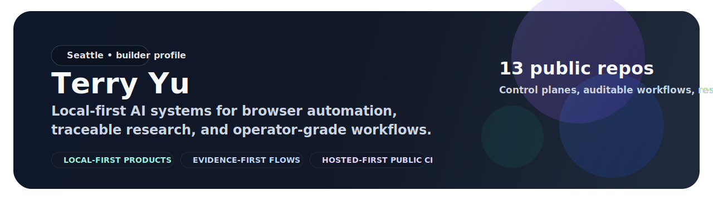

  

<h1 align="center">Terry Yu</h1>

<strong>Building AI tools for browser workflows, source-grounded research, and operator-facing software.</strong>

  
  
  
  

  <a href="https://github.com/xiaojiou176-open"><strong>Open portfolio</strong></a> •
  <a href="https://www.linkedin.com/in/terry-yu-52b6b1252"><strong>LinkedIn</strong></a> •
  <a href="#start-here"><strong>Start here</strong></a> •
  <a href="#open-source-portfolio-map"><strong>Portfolio map</strong></a> •
  <a href="#how-i-like-to-build"><strong>Build philosophy</strong></a>

I build products that do concrete work: run browser workflows, generate frontend files from UI briefs, turn noisy source streams into reusable digests, and export research into inspectable markdown. What ties the portfolio together is not a slogan. It is a practical bias toward tools that are easier to run, review, and recover when something breaks.

- CS @ University of Washington '27
- AI Engineer at Casium
- Based in Seattle

## What I actually build

The work on this page is not a random repo pile. It is one connected portfolio with a few recurring job types:

Instead of talking only in abstract principles, the easiest way to read this portfolio is by the work it helps someone do:

<table>
  <tr>
    <td width="50%" valign="top">
      <strong>Run and supervise AI workflows</strong> 
      Control planes, governed task execution, replayable runs, and operator visibility.
    </td>
    <td width="50%" valign="top">
      <strong>Run browser automation without going blind</strong> 
      Repeatable automation, inspectable evidence, release-ready quality gates, and proof-first tooling.
    </td>
  </tr>
  <tr>
    <td width="50%" valign="top">
      <strong>Turn raw sources into reusable knowledge</strong> 
      Source-grounded writing, searchable corpora, and audit-friendly knowledge flows.
    </td>
    <td width="50%" valign="top">
      <strong>Build user-facing tools with clear ownership</strong> 
      Products that keep users close to their own data, current state, and recovery path.
    </td>
  </tr>
</table>

## Start here

These are the six projects I would point a first-time visitor to, because together they show the clearest range of what I actually ship:

<table>
  <tr>
    <td width="33%" valign="top">
      <strong><a href="https://github.com/xiaojiou176-open/CortexPilot-public">CortexPilot-public</a></strong> 
      Run governed AI tasks, inspect evidence bundles, and replay failures without guesswork.
    </td>
    <td width="33%" valign="top">
      <strong><a href="https://github.com/xiaojiou176-open/ui-automation-control-plane">ui-automation-control-plane</a></strong> 
      Run browser workflows, review proof, and decide whether a result is ready to ship.
    </td>
    <td width="33%" valign="top">
      <strong><a href="https://github.com/xiaojiou176-open/openui-mcp-studio">openui-mcp-studio</a></strong> 
      Turn UI briefs into React and shadcn files you can preview and verify.
    </td>
  </tr>
  <tr>
    <td width="33%" valign="top">
      <strong><a href="https://github.com/xiaojiou176-open/sourceharbor">sourceharbor</a></strong> 
      Subscribe to source streams and turn them into digests, job traces, and searchable artifacts.
    </td>
    <td width="33%" valign="top">
      <strong><a href="https://github.com/xiaojiou176-open/multi-ai-sidepanel">multi-ai-sidepanel</a></strong> 
      Compare major AI tools side by side in one browser surface.
    </td>
    <td width="33%" valign="top">
      <strong><a href="https://github.com/xiaojiou176-open/provenote">provenote</a></strong> 
      Import one source, search it, and export auditable markdown you can inspect later.
    </td>
  </tr>
</table>

## What a visitor can do from here

If you are here to evaluate the work quickly:

- use the pinned repos as the fast path to the strongest public projects
- use the org page as the full atlas of all 13 open-source repos
- treat each repo README as a front door that should tell you the fastest honest first result
- expect practical entrypoints, not just architectural philosophy

## Open-source portfolio map

All **13 public repositories** in [xiaojiou176-open](https://github.com/xiaojiou176-open), grouped by what they are trying to do:

<table>
  <tr>
    <td width="50%" valign="top">
      <strong>Orchestration and control planes</strong>  
      <a href="https://github.com/xiaojiou176-open/CortexPilot-public">CortexPilot-public</a> 
      Governed AI task orchestration with evidence, replay, and operator visibility.  
      <a href="https://github.com/xiaojiou176-open/ui-automation-control-plane">ui-automation-control-plane</a> 
      Browser automation control plane for repeatable proof and release-ready quality gates.
    </td>
    <td width="50%" valign="top">
      <strong>Auditable browser workflows</strong>  
      <a href="https://github.com/xiaojiou176-open/prooftrail">prooftrail</a> 
      Auditable browser automation for repeatable runs and recovery-ready workflows.  
      <a href="https://github.com/xiaojiou176-open/multi-ai-sidepanel">multi-ai-sidepanel</a> 
      Local-first browser extension for side-by-side AI comparison in the browser.  
      <a href="https://github.com/xiaojiou176-open/campus-copilot">campus-copilot</a> 
      Local-first academic organizer for Canvas, Gradescope, EdStem, and MyUW.
    </td>
  </tr>
  <tr>
    <td width="50%" valign="top">
      <strong>Research and knowledge systems</strong>  
      <a href="https://github.com/xiaojiou176-open/sourceharbor">sourceharbor</a> 
      Turn YouTube, Bilibili, and RSS into traceable digests and searchable knowledge flows.  
      <a href="https://github.com/xiaojiou176-open/provenote">provenote</a> 
      Source-grounded writing, searchable sources, auditable markdown, and traceable outputs.  
      <a href="https://github.com/xiaojiou176-open/docsiphon">docsiphon</a> 
      Convert docsites into AI-ready local corpora with preserved paths and audit artifacts.
    </td>
    <td width="50%" valign="top">
      <strong>Product-facing AI tools</strong>  
      <a href="https://github.com/xiaojiou176-open/openui-mcp-studio">openui-mcp-studio</a> 
      Generate, apply, and verify production-ready React and shadcn UI from natural-language briefs.  
      <a href="https://github.com/xiaojiou176-open/dealwatch">dealwatch</a> 
      Cross-store grocery price tracking with compare preview, watch tasks, and alert history.  
      <strong>Local-first macOS and recovery tools</strong>  
      <a href="https://github.com/xiaojiou176-open/apple-notes-snapshot">apple-notes-snapshot</a> 
      Local-first Apple Notes backup control room for macOS.  
      <a href="https://github.com/xiaojiou176-open/apple-notes-forensics">apple-notes-forensics</a> 
      Copy-first Apple Notes recovery toolkit with reviewable outputs.  
      <a href="https://github.com/xiaojiou176-open/movi-organizer">movi-organizer</a> 
      Local-first AI-assisted media organizer built around manifest-driven workflows.
    </td>
  </tr>
</table>

## What ties the portfolio together

Even when the repos look different on the surface, the same practical preferences keep showing up:

- visible state over hidden magic
- reviewable outputs over “trust me” demos
- recovery paths over brittle one-shot flows
- practical front doors over repo archaeology
- software that can be run, inspected, and explained by another human

## How I like to build

- Local-first when it improves trust, recovery, and user control
- Evidence-first when a system makes claims about what happened
- Operator-visible when workflows would otherwise turn into black boxes
- Hosted-first for public CI, with sensitive lanes gated behind explicit approvals
- Products that can be explained clearly, debugged locally, and recovered without heroics

## Suggested tours

- **For AI orchestration:** start with [CortexPilot-public](https://github.com/xiaojiou176-open/CortexPilot-public)
- **For browser automation and proof:** start with [ui-automation-control-plane](https://github.com/xiaojiou176-open/ui-automation-control-plane) and [prooftrail](https://github.com/xiaojiou176-open/prooftrail)
- **For research workflows:** start with [sourceharbor](https://github.com/xiaojiou176-open/sourceharbor), [provenote](https://github.com/xiaojiou176-open/provenote), and [docsiphon](https://github.com/xiaojiou176-open/docsiphon)
- **For product-facing AI UX:** start with [openui-mcp-studio](https://github.com/xiaojiou176-open/openui-mcp-studio) and [multi-ai-sidepanel](https://github.com/xiaojiou176-open/multi-ai-sidepanel)
- **For local-first utilities:** start with [apple-notes-snapshot](https://github.com/xiaojiou176-open/apple-notes-snapshot), [apple-notes-forensics](https://github.com/xiaojiou176-open/apple-notes-forensics), and [movi-organizer](https://github.com/xiaojiou176-open/movi-organizer)

## Elsewhere

- Public work and repo lineup: [xiaojiou176-open](https://github.com/xiaojiou176-open)
- LinkedIn: [terry-yu](https://www.linkedin.com/in/terry-yu-52b6b1252)
